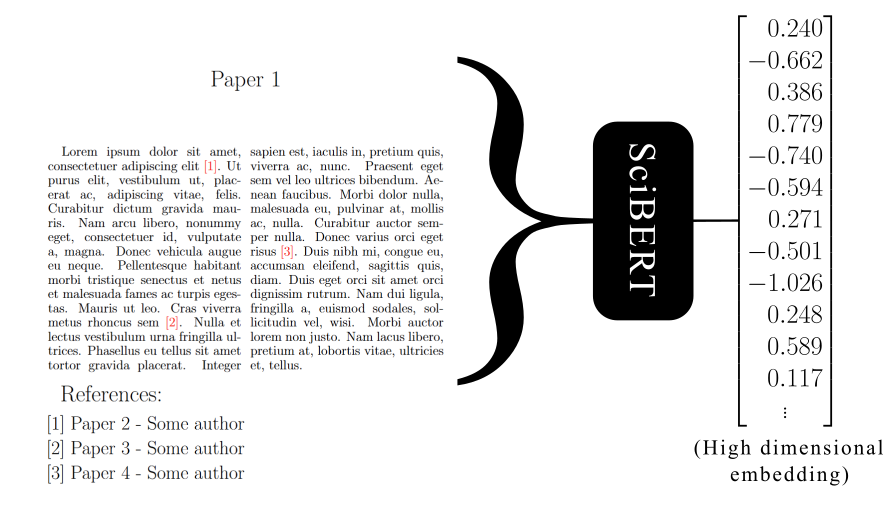
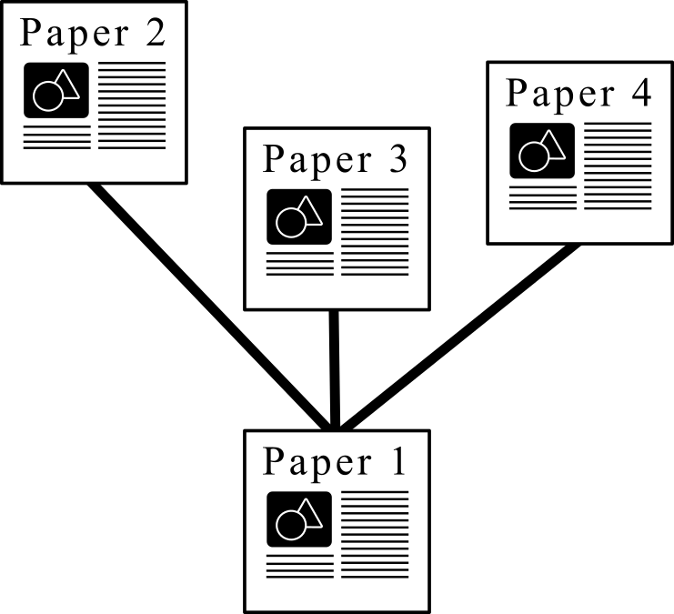

# Science_Genome
This is the code for my transaction paper on my noval analysis of dynamic scientific space in the form of a pseudo-genome in the form of transformer embeddings, and watching the evolution of these ideas through a family tree DAG.

  
  

## Installation 

